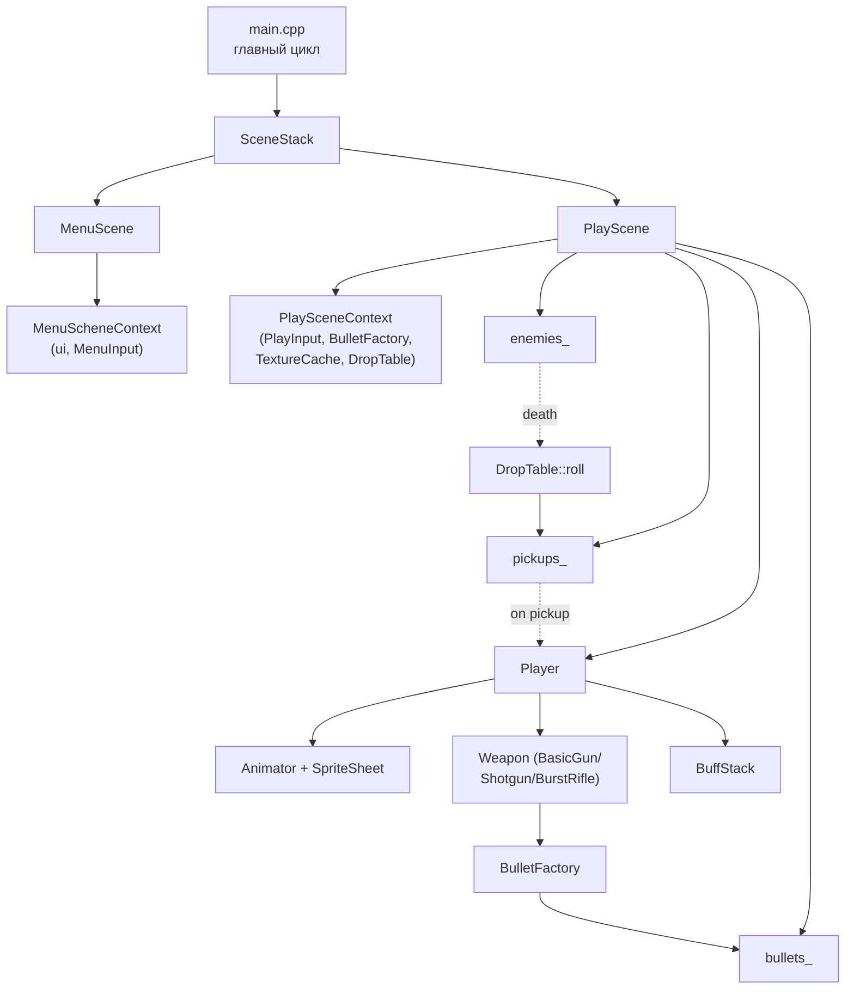
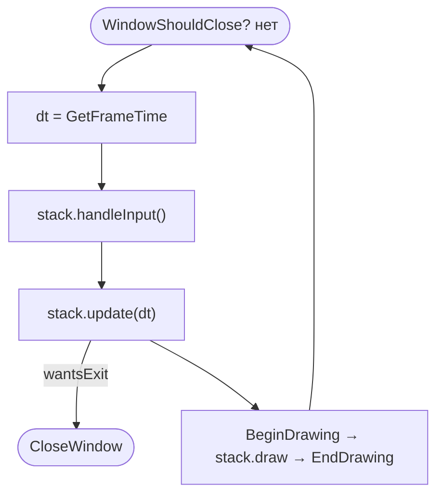
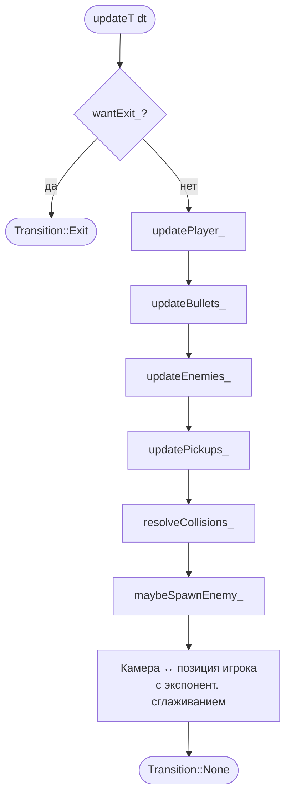
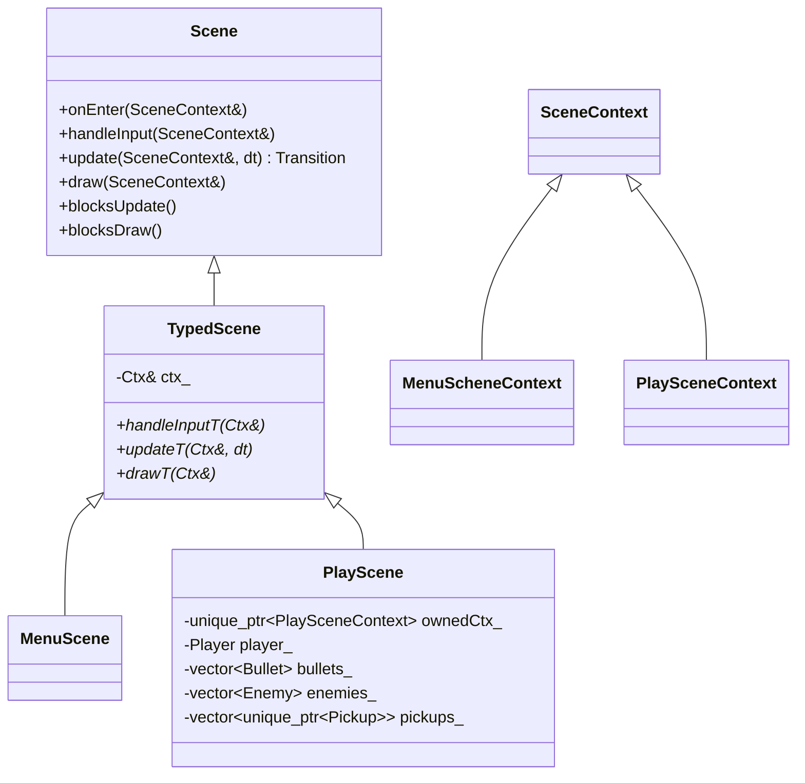
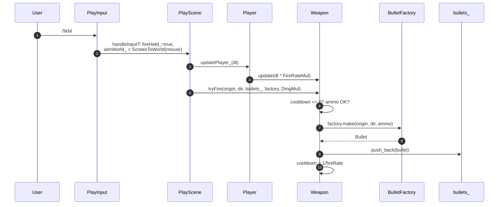
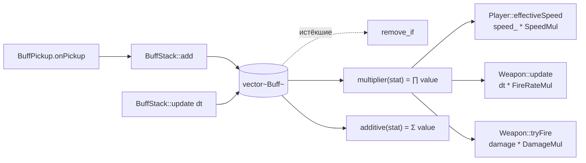

# Архитектура проекта

Top-down shooter на raylib. Документ описывает, как соединены модули, как
проходит один кадр, и где что искать, когда нужно что-то добавить.

> Все диаграммы — на Mermaid. Откроется в любом современном просмотрщике
> Markdown (VSCode, GitHub, JetBrains). Если рендера нет — читай как
> текстовый граф.

---

## 1. Структура каталогов

```
src/
├── main.cpp                 ← точка входа: окно, SceneStack, главный цикл
├── INFO.md                  ← этот файл
│
├── util/
│   └── Log.h                ← макросы LOG_T/D/I/W/E поверх TraceLog
│
├── config/
│   ├── Action.h             ← enum действий (Up/Down/Left/Right/Fire/...)
│   ├── Input.h              ← интерфейс ввода (poll/down/pressed)
│   ├── MenuInput.{h,cpp}    ← ввод в меню (клавиатура: стрелки/Enter)
│   ├── PlayInput.{h,cpp}    ← ввод в игре (WASD + ЛКМ)
│   ├── Button.{h,cpp}       ← кнопка меню
│   ├── UiMenuTheme.h        ← цвета/размеры меню
│   └── defines.h
│
├── gfx/
│   ├── TextureCache.h       ← key→Texture2D, владеет ресурсами
│   ├── SpriteSheet.h        ← Texture2D* + список Rectangle-кадров
│   └── Animator.h           ← состояния → кадры; тикает по dt/fps
│
├── scenes/
│   ├── Scene.h              ← базовый интерфейс сцены + Transition
│   ├── TypedScene.h         ← шаблон с типизированным контекстом
│   ├── SceneContext.h       ← общая база контекста (screenW/H)
│   ├── SceneStack.{h,cpp}   ← стек сцен, маршрутизирует input/update/draw
│   ├── MenuScene.{h,cpp}    ← главное меню (PLAY / OPTIONS / EXIT)
│   ├── MenuSceneContext.h
│   ├── PlayScene.{h,cpp}    ← игровая сцена (см. раздел 4)
│   └── PlaySceneContext.h   ← input + bullets + textures + dropTable
│
├── units/
│   ├── GameActor.h          ← база (Vector2 pos_, move/draw/update)
│   ├── Player.{h,cpp}       ← игрок + Animator + Weapon + BuffStack
│   ├── Enemy.h              ← простой враг (HP, преследует игрока)
│   ├── Bullet.h             ← POD: pos/vel/ttl/damage
│   ├── BulletConfig.h       ← параметры пули по виду
│   ├── BulletFactory.h      ← конструктор пуль по ProjectileKind
│   └── BuffStack.h          ← модификаторы статов (Damage/Speed/...)
│
├── weapons/
│   ├── WeaponConfig.h       ← fireRate/spread/magazine/...
│   ├── Weapon.h             ← база (cooldown, reload, firePattern)
│   ├── BasicGun.h           ← одиночный
│   ├── Shotgun.h            ← конус из N пуль
│   └── BurstRifle.h         ← очередь из N выстрелов с задержкой
│
└── pickups/
    ├── Pickup.h             ← база, onPickup(Player&)
    ├── WeaponPickup.h       ← даёт игроку оружие (через Maker-лямбду)
    ├── BuffPickup.h         ← навешивает Buff
    └── DropTable.h          ← взвешенный random по очкам
```

---

## 2. Общая архитектура



Стрелка вниз = «создаёт / содержит». Пунктир = событийная связь (не
храним ссылку, но в момент события передаём данные).

---

## 3. Жизненный цикл одного кадра



`SceneStack` идёт по стеку сверху вниз и спрашивает у сцен
`blocksUpdate()`/`blocksDraw()`. Это значит: будущая `PauseScene`
сможет лежать поверх `PlayScene`, замораживая update, но позволяя
рисовать игру под собой полупрозрачным фоном.

---

## 4. Цикл `PlayScene::updateT`



**Почему такой порядок:**
1. Сначала двигаем игрока — он определяет цель для врагов и направление огня.
2. Пули двигаем после игрока — новые пули в этом кадре уже улетят на свой шаг.
3. Враги идут к свежей позиции игрока.
4. Пикапы только чистим (логика «подбора» в коллизиях).
5. Коллизии — единственное место, где меняется здоровье/состояние.
6. Спавн врагов — в конце, чтобы новый враг не успел врезаться в игрока в этом же кадре.

---

## 5. Сцены и контексты



**TypedScene** убирает кастинг: сцена работает с конкретным типом
контекста (`PlaySceneContext`), а `SceneStack` — через базу. Виртуальные
методы базы (`handleInput(SceneContext&)`) переадресуют в типизированные
(`handleInputT(Ctx&)`).

**Утечка**, которая была: `MenuScene` делал `new PlaySceneContext` и не
удалял. Теперь PlayScene владеет своим контекстом через `unique_ptr` —
при `pop()` всё чистится.

---

## 6. Поток выстрела



Оружие — единственный, кто решает, **можно** ли стрелять (кулдаун,
магазин, режим очереди). Сцена просто говорит «жму огонь». Это позволяет
менять оружие без правок в PlayScene.

---

## 7. Стек оружий и пикапов

```mermaid
flowchart LR
    enemyDead[Враг умер] -->|score += 10| roll["DropTable::roll(score)"]
    roll -->|по minScore + weight| entry[Случайная запись таблицы]
    entry --> mk{maker(pos)}
    mk -->|WeaponPickup| wp[WeaponPickup<br/>хранит Maker-лямбду]
    mk -->|BuffPickup| bp[BuffPickup<br/>хранит Buff]
    wp -.player подошёл.-> equip["player.equip(maker())"]
    bp -.player подошёл.-> add["player.buffs().add(buff)"]
```

Таблица настраивается данными, а не кодом. Чтобы добавить новый
дроп — одна `add({minScore, weight, [](Vector2 p){return ...;}, "tag"})`
в `DropTable::defaultTable()`.

**WeaponPickup** хранит фабрику-лямбду, а не конкретный класс — это
позволяет не тащить заголовки всех оружий в место, где спавнятся пикапы.

---

## 8. Бафы и расчёт статов



Бафы — это данные, а не наследники. Новая характеристика = одно
значение в `enum Buff::Stat` + одно место, где применяется множитель.

**FireRateMul** реализован как «ускорение времени» для оружия:
`weapon_->update(dt * mul)`. Cooldown декрементится быстрее → выстрелы
чаще. Это работает и для очередей (BurstRifle), потому что они тоже
тикают по dt.

---

## 9. Жизненный цикл пули

```mermaid
stateDiagram-v2
    [*] --> Active: factory.make()<br/>active=true, ttl=1.5
    Active --> Active: update(dt)<br/>pos += vel*dt; ttl -= dt
    Active --> Dead: ttl <= 0
    Active --> Dead: попала в Enemy
    Dead --> [*]: remove_if в updateBullets_
```

---

## 10. Логи

`Log.h` оборачивает `TraceLog` и добавляет тег в квадратных скобках.

```
[APP]    жизненный цикл приложения / окна
[SCENE]  переходы, спавны
[PLAYER] загрузка, урон, смерть, смена оружия
[WEAPON] перезарядка
[BUFF]   получение бафа
[ENEMY]  убийства (TRACE — много)
[DROP]   что выпало из таблицы (TRACE)
```

Уровень в `main.cpp`:
```cpp
SetTraceLogLevel(LOG_DEBUG);   // показывать DEBUG и выше
// LOG_WARNING — почти тишина
// LOG_TRACE — будет видно каждое событие
```

---

## 11. Как добавить новое

### Новое оружие
1. Файл в `src/weapons/MyGun.h`, наследник `Weapon`.
2. В конструкторе — `Weapon(makeConfig())` с настройками.
3. Если паттерн не одиночный — переопредели `firePattern(...)` (см. Shotgun).
4. Если оружие stateful (очередь и т.п.) — `update(dt)` (см. BurstRifle).
5. В `DropTable::defaultTable()` добавь запись с фабрикой `std::make_unique<MyGun>()`.

### Новый баф
1. Новое значение в `enum class Buff::Stat`.
2. В точке применения умножь/прибавь: `buffs_.multiplier(NewStat)`.
3. В `PlayScene::drawHud_` добавь case в свитче имени.
4. В `DropTable::defaultTable()` — `Buff{NewStat, value, duration, 0.f}`.

### Новый враг
1. Наследник `GameActor` (или сделай enum типов в Enemy).
2. Логику движения вынеси в `update`/`chase`.
3. В `PlayScene::maybeSpawnEnemy_` добавь выбор типа.
4. В `resolveCollisions_` уже работает — он смотрит на `radius()`/`alive()`.

### Кадры анимации Player
1. Положи sprite-sheet в `resources/textures/units/player/`.
2. В `Player::Player` заполни `sheet_.frames` всеми прямоугольниками.
3. Зарегистрируй анимации через `anim_.add("walk_right", {{0,1,2,3}, 8.f, true})`.
4. В `setMoving`/`update` выбирай нужное состояние по направлению.

### Новая сцена (например, Pause)
1. Контекст `PauseSceneContext : SceneContext`.
2. Сцена `PauseScene : TypedScene<PauseSceneContext>`.
3. Переопредели `blocksUpdate()` → `true`, `blocksDraw()` → `false`.
4. Открой через `Transition::Push([]{ return std::make_unique<PauseScene>(...); })`.

---

## 12. Сборка под Linux

```bash
# deps один раз
sudo apt install -y libxrandr-dev libxinerama-dev libxcursor-dev \
    libxi-dev libgl-dev libxkbcommon-dev

# генерация Makefile (после добавления/удаления .cpp файлов)
chmod +x build/premake5
cd build && ./premake5 gmake && cd ..

# сборка
make config=debug_x64        # ~1-2 мин первый раз (компилирует raylib)
./bin/Debug/raylibFirstTry
```
